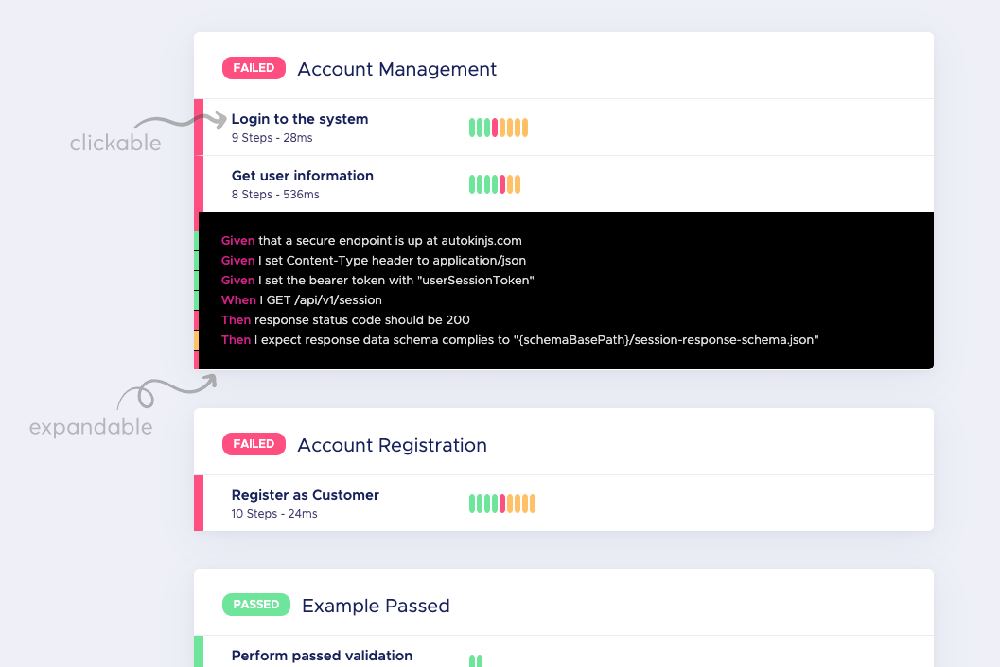

# autokin-html-formatter

Autokin formatter that produced pretty HTML file for easy viewing of test results. Default HTML formatter for Autokin. This formatter can also be used with any cucumberjs project.

## Installation
```
npm install --save-dev autokin-html-formatter
```

## Use
```
cucumber-js -f node_modules/autokin-html-formatter[:<output-html-file>]
```

## Example Output



## References
- https://github.com/cucumber/cucumber-js/blob/master/docs/custom_formatters.md
